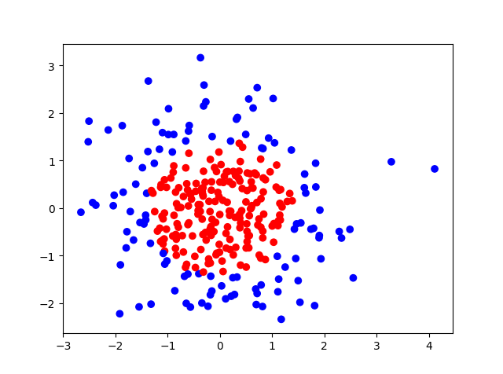
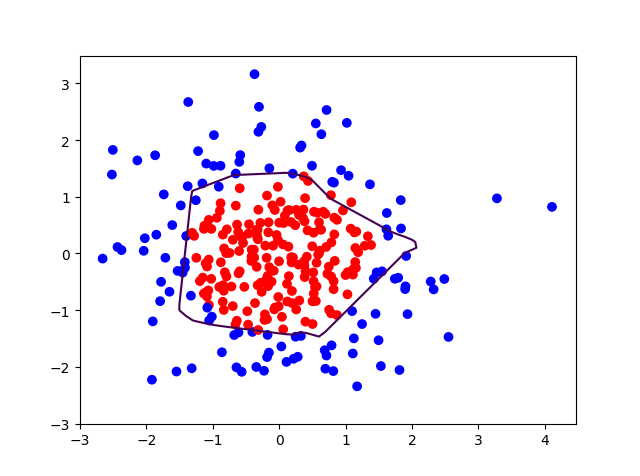
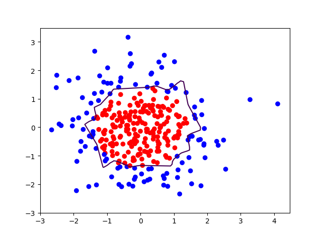

# 北京大学：人工智能实践：Tensorflow笔记

## 1. 环境搭建

ubuntu安装和python安装

### 1.1 概述

### 1.2 双系统安装

下载[Ubuntu LTS](http://www.ubuntu.org.cn/download)系统

### 1.3 Windows 虚拟机安装

windows下载[VirtualBox](https://www.virtualbox.org/wiki/Downloads)或[Vmare](https://www.vmware.com/cn.html),可以安装虚拟机

### 1.4 Win10 应用商店可以直接安装ubuntu


### 1.4 Mac Tensorflow 安装

安装Anaconda或pip安装管理python包

## 2. python 基础

### 2.1 Linux 命令、hello world

- Linux 命令
    - cd ： 到要的路径
    - ls ： 列出路径文件
    - vim ：编辑器
    - gedit : 编辑器
    - cat ： 查看文件内容
    - touch ：新建文件
    - mkdir ：新建文件夹
    - python ：运行python脚本
    - find ：查找
    - mv ：移动文件(夹)
    - cp : 复制文件(夹)

- hello world

```python
print('hello world')
```

### 2.2 列表、元组、字典

### 2.3 条件语句

### 2.4 循环语句

### 2.5 turtle模块

### 2.6 文件操作

### 2.7 类、对象、面向对象编程

### 2.8 文件操作

## 3. Tensorflow 基本概念

### 3.1 张量、计算图、会话

### 3.2 前向传播

### 3.3 反向传播

## 4. 神经网络基本概念

### 4.1 损失函数

预测值和真实值的差距

- mse(均方损失函数): (y_p - y_t)^2

```python
    loss_mes = tf.reduce_mean(tf.square(y_p - y_t))
```

- CE(交叉熵): -y_t*log(y_p)

```python
    ce = -tf.reduce_mean(y_t*tf.log(tf.clip_by_value(y_p,1e-12,1.0)))
```

    **使用softmax的话用下面代码**

```python
    ce = tf.nn.spare_sotfmax_cross_entropy_with_logits(logits = y_p,labels = tf.argmax(y_t,1)) 
    cem = tf.reduce_mean(ce)
```

- 自定义loss:

```python
loss = tf.reduce_sum(tf.where(tf.greater(y_t,y_p),alpha*(y_t,y_p),(1-alpha)*(y_p-y_t)))
# 可以通过设置不同的 **alpha** 使预测往预想的方向偏移，也可以用来调节样本不平衡
```

### 4.2 学习率

每次参数更新的幅度，学习率大了震荡不收敛，小了收敛速度慢

- 指数衰减学习率
    lr = lr_base * lr_decay ^ ( global_step/learn_rate_step)
    - lr_base : 基础学习率
    - lr_decay : 衰减率
    - global_step : 运行几轮
    - learn_rate_step : 多少轮衰减一次

```python
global_step = tf.Variable(0,trainable = False)
lr = tf.train.exponential_decay(
    lr_base,
    global_step,
    learn_rate_step,
    lr_decay,
    staircase = Ture) #staircase = Ture 时，global_step/learn_rate_step 取整
```

### 4.3 滑动平均

记录了每个参数一段时间内过往值的平均，增加了模型泛化性

```math
滑动平均值 = 衰减率 * 滑动平均值(前一次) + (1 - 衰减率) * 参数值        滑动平均初值 = 参数初值
衰减率 = min{MOVING_AVERAGE_DECAY, (1 + 轮数) / (10 + 轮数)}
```

```python
ema = tf.train.ExponentialMovingAverage(MOVING_AVERAGE_DECAY,global_step)
ema_op = ema.apply(tf.trainable_variables())        #所有待优化的参数求滑动平均
with tf.contral_dependencies([train_step,ema_op]):  #滑动平均和训练绑定为一个节点
    train_op = tf.no_np(name='train')
```

### 4.4 正则化

正则化缓解过拟合，在损失函数中引入模型复杂度指标，利用其给**W加权值**，软化训练数据噪声(一般不对偏置b正则化)

```math
loss = loss(y_p,y_t) + REGULARIZER * loss(w)
第一个loss表示模型中所有参数的损失函数，第二个loss是需要正则化的参数,REGULARIZER超参
```

- l1 一节正则化， loss_l1(w) = sum(abs(w))

```python
loss(w) = tf.contrib.layers.l1_regularizer(REGUIARIZER)(w)
```

- l2 二阶正则化， loss_l2(w) = sum(w^2)

```python
loss(w) = tf.contrib.layers.l2_regularizer(REGUIARIZER)(w)
```

使用

```python
tf.add_to_collection('losses',tf.contrib.layers.l2_regularizer(regularizer)(w)) #把内容加到集合，对应位置做加法
loss = cem + tf.add_n(tf.get_collecton('losses))
```



- 生成点可视化



- 无正则化训练结果



- 正则化训练结果

### 4.5 神经网络搭建八股

1. forward.py

```python
    def forward(x,regularizer):
        w = 
        b = 
        y = 
        return y

    def get_weight(shape,regularizer):
        w = tf.Variable()
        tf.add_to_collection('losses',tf.contrib.l2_regularizer(regularizer)(w))
        return w

    def get_bias(shape):
        b = tf.Variable()
        return b
```

2. backward.py

```python
def backward():
    x = tf.placeholder()
    y_ = tf.placeholder()
    y = forward.forward(x,REGULARIZER)
    global_step = tf.Variable(0,trainable=False)
    loss = 

均方差
loss_mes = tf.reduce_mean(tf.square(y_p - y_t))
交叉熵
ce = tf.nn.spare_sotfmax_cross_entropy_with_logits(logits = y_p,labels = tf.argmax(y_t,1))
loss_ce = tf.reduce_mean(ce)

正则化
loss = loss_base + tf.add_n(tf.get_collection('losses'))

指数衰减学习率
lr = lr_base * lr_decay ^ ( global_step/learn_rate_step)
- lr_base : 基础学习率
- lr_decay : 衰减率
- global_step : 运行几轮
- learn_rate_step : 多少轮衰减一次

滑动平均
ema = tf.train.ExponentialMovingAverage(MOVING_AVERAGE_DECAY,global_step)
ema_op = ema.apply(tf.trainable_variables())        #所有待优化的参数求滑动平均
with tf.contral_dependencies([train_step,ema_op]):  #滑动平均和训练绑定为一个节点
    train_op = tf.no_np(name='train')


train_step = tf.train.GradientDesentOptimizer(lr).minimize(loss,global_step = global_step)

with tf.Session() as sess:
    init_op = tf.global_variables_initializer()
    sess.run(init_op)

    for i in range(STEPS):
        sess.run(train_step,feed_dict={x: ,y_: })
        if i % 轮数 ==0：
            print

if __name__ = '__main__':
    backward()

```

## 5. MNIST识别-1

### 5.1 MNIST数据集

### 5.2 模块搭建神经网络八股

### 5.3 手写数字设别准确率输出

## 6. MNIST识别-2

### 6.1 输入手写数字图片输出识别结果

### 6.2 制作数据集

## 7. 卷积神经网络基础

### 7.1 卷积神经网络

### 7.2 lenet5代码

## 8. vgg16

### 8.1 复现已有的卷积神经网络

### 8.2 用vgg16 实现图片识别